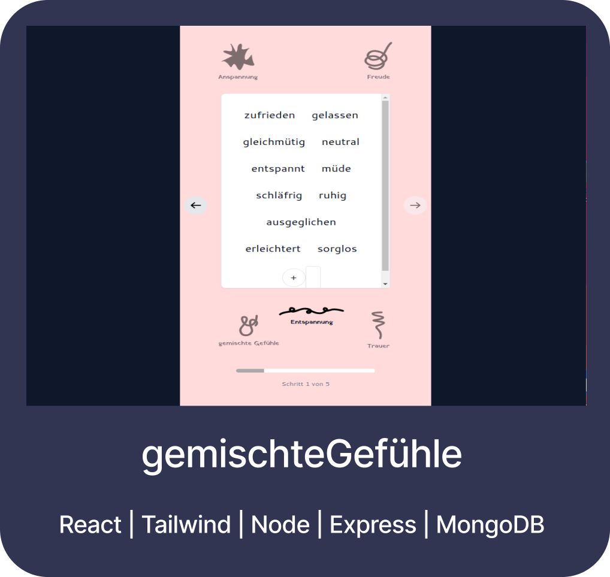
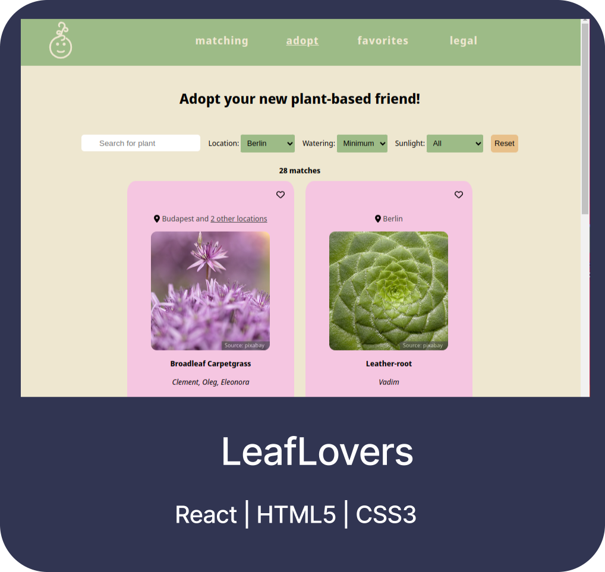
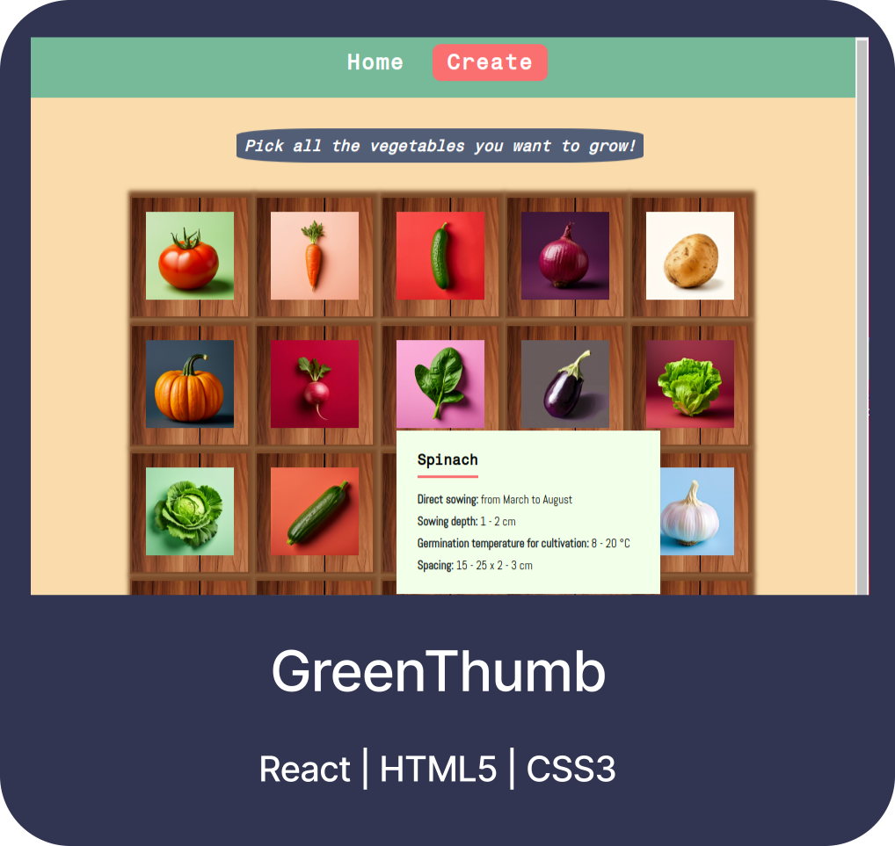
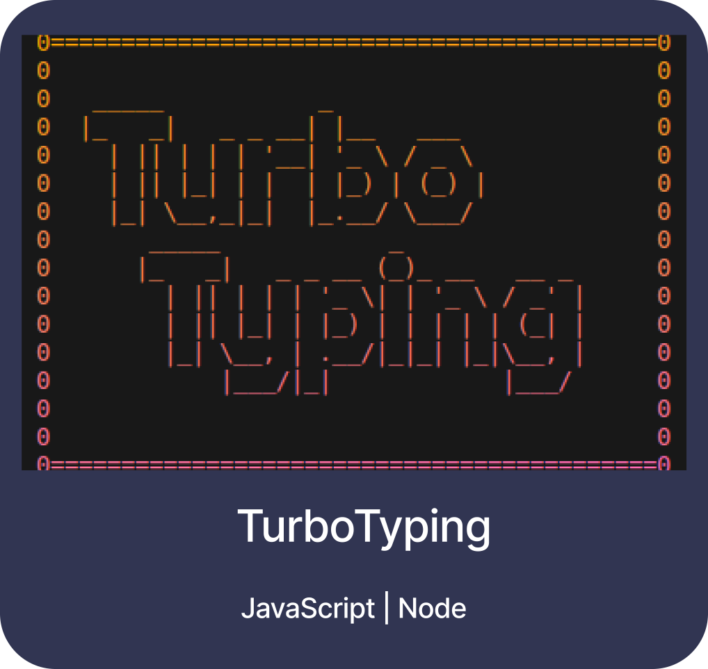

## Hi, I am Hannah

I am a Full-stack Web Developer based in Leipzig.

## Current Projects

|                                                                                                                           |                                                          |                                                                                      |
| ---------------------------------------------------------------------------------------------------------------------------------------------------------------------------------------------- | --------------------------------------------------------------------------------------------------------------------- | -------------------------------------------------------------------------------------------------------------------------------------------------- |
| **gemischteGefühle**   [Frontend](https://github.com/MindfulStudio/frontend) \| [Backend](https://github.com/MindfulStudio/backend) \| [Live Demo](https://gemischtegefuehle.onrender.com/) | **Portfolio**   [GitHub](https://github.com/hannahnier/portfolio) \| [Live Demo](https://hannahnier.onrender.com/) | **ClockworkClementine**   [GitHub](https://github.com/hannahnier/ClockworkClementine) \| [Live Demo](https://clockworkclementine.onrender.com/) |

More Projects

|                                                       |                                                           |                                                            |
| -------------------------------------------------------------------------------------------------------------- | ----------------------------------------------------------------------------------------------------------------------- | ------------------------------------------------------------------------------------------------------------------------ |
| **H&B Paint**   [GitHub](https://github.com/hannahnier/paint) \| [Live Demo](https://hb-paint.netlify.app/) | **LeafLovers**   [GitHub](https://github.com/hannahnier/LeafLovers) \| [Live Demo](https://leaflovers.onrender.com/) | **GreenThumb**   [GitHub](https://github.com/hannahnier/green-thumb) \| [Live Demo](https://greenthumb.onrender.com/) |

|                                                                  |           |     |
| ------------------------------------------------------------------------------------------------------------------------------- | ------------------------------------------------------------------------ | --- |
| **Laundromat**   [GitHub](https://github.com/hannahnier/Laundromat) \| [Live Demo](https://hannahnier.github.io/Laundromat/) | **TurboTyping**   [GitHub](https://github.com/hannahnier/TurboTyping) |     |

## Skills

  <strong>Frontend:</strong> 
  &nbsp;
  &nbsp;
  &nbsp;
  &nbsp;
  &nbsp;
  &nbsp;
  &nbsp;
  | <strong>Backend:</strong> 
  &nbsp;
  &nbsp;
  &nbsp;
  &nbsp;
  | <strong>Tools:</strong> 
  &nbsp;
  &nbsp;
  &nbsp;
  &nbsp;

## Get in touch

Connect with me on [LinkedIn](https://www.linkedin.com/in/hannah-rein-74419b30b/) or use the contact form at the bottom of [my Portfolio](https://hannahnier.onrender.com/).
