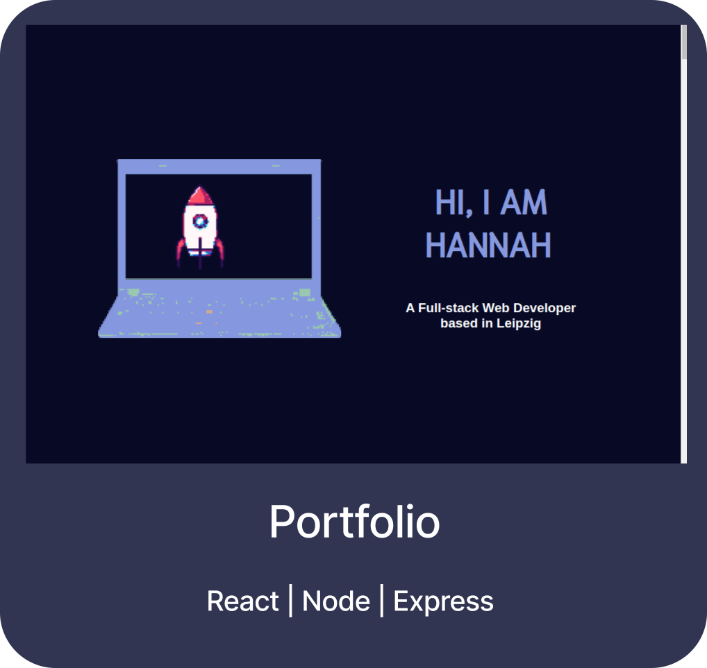

## Hi, I am Hannah

I am a Full-stack Web Developer with a strong emphasis on problem-solving and a keen eye for details.

#### Current Projects on GitHub

Explore more Projects

 

Skills

#### Frontend

&nbsp;
&nbsp;
&nbsp;
&nbsp;
&nbsp;
&nbsp;
&nbsp;

#### Backend

&nbsp;
&nbsp;
&nbsp;
&nbsp;

#### Tools

&nbsp;
&nbsp;
&nbsp;
&nbsp;

  

   

You can reach out to me on [LinkedIn](https://www.linkedin.com/in/hannah-rein-74419b30b/) or through the contact form at the bottom of [my Portfolio](https://hannahnier.onrender.com/).
