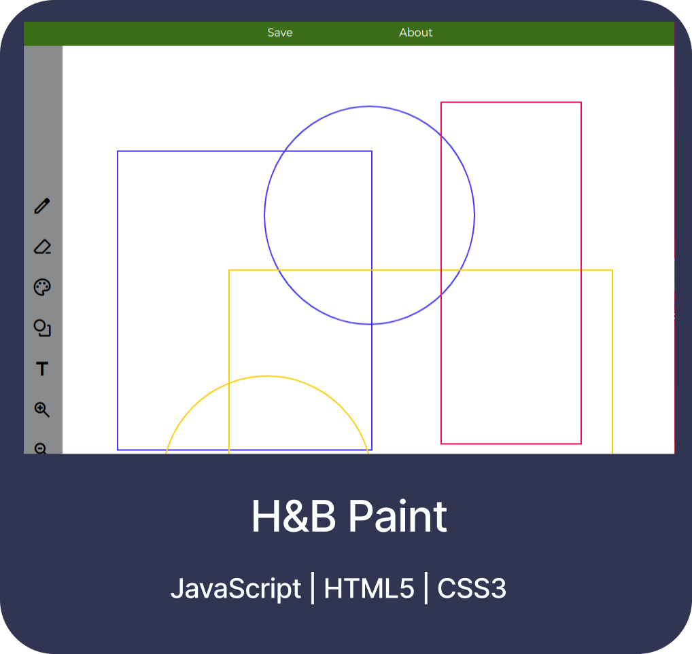
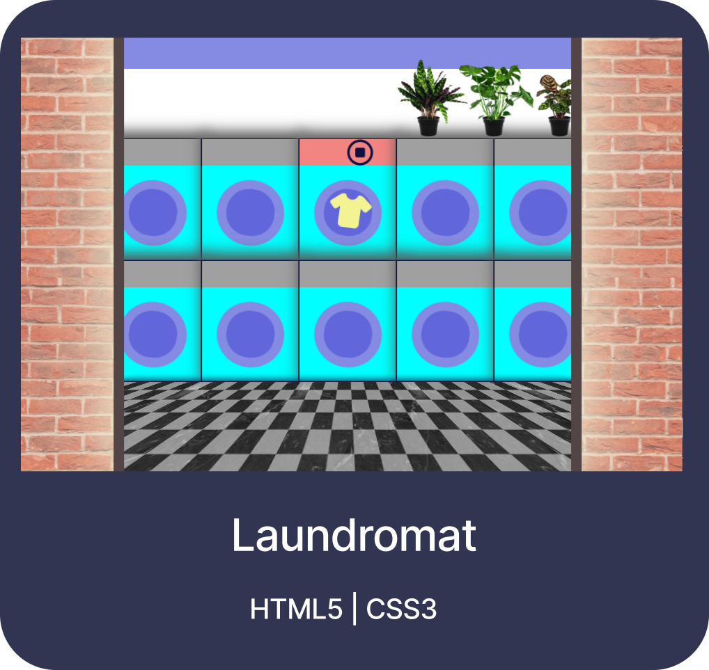

<h2 align="center">Hi, I am Hannah</h2>

I am a Full-stack Web Developer with a strong emphasis on problem-solving and a keen eye for details.

<h4 align="center">Projects</h4>

 

<h4 align="center">Skills</h4>

&nbsp;
&nbsp;
&nbsp;
&nbsp;
&nbsp;
&nbsp;
&nbsp;
&nbsp;
&nbsp;
&nbsp;
&nbsp;
&nbsp;
&nbsp;
&nbsp;
&nbsp;

<h4 align="center">Contact</h4>

You can reach out to me on <a href="https://www.linkedin.com/in/hannah-rein-74419b30b/" target="_blank">LinkedIn</a> or through the contact form at the bottom of <a href="https://hannahnier.onrender.com/">my Portfolio</a>.

